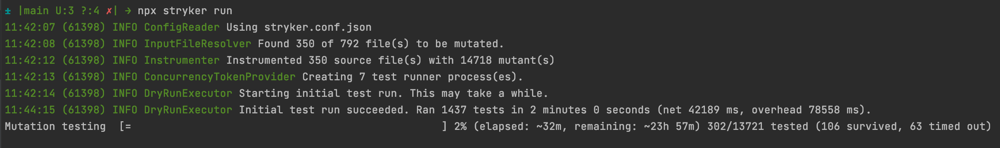

# Mutation testing

## Code Coverage
###  What is it?
```
Number of lines(*) executed by the tests
---------------------------------------- x 100
  Total number of lines(*) in the code
```
<sup>* Not only lines but also functions, branches and statements</sup>

### What does it really mean to have 80% coverage?
* 20% of the code was not executed (Not tested at all)
* 80% of the code was executed (There is a non-zero chance of having it properly tested)
  * Common issues:
    * Important scenarios not covered
    * Testing mocks instead of the actual code
    * Biased tests
    * Bugs in test code

## Tests quality
### What would we expect from our tests?
* They should detect changes made to the code

### How can we assess the quality of our tests?
* Analysing each test
* Mutation testing

## Mutation testing
### How does mutation testing work?
1. Introduce one single change to the code (mutant)
2. Run the tests
3. Analyse
   * Tests fail ❌: The change was detected (mutant killed 👍 )
     * Back to step 1
   * Tests pass ✅: The change as not detected (mutant survived 👎 )
     * Add tests to detect the changes
     * Back to step 1

### How to automate it?
We can rely on several frameworks for the most relevant programming languages. They will make a copy of the code base for every change they introduce based on their mutator libraries and run all the tests for each one.

Examples of mutation testing frameworks
  * JavaScript: [Stryker Mutator](https://stryker-mutator.io/)
  * Java: [PIT Mutation Testing](https://pitest.org/)

### Challenges
* Long feedback cycle
* Too many mutants to deal with

  
### Strategies
* Pipeline
  * Do not run it in the main pipeline
  * Run over the weekend
* Local
  * Mutate only the files you're changing


    ```
    $ npm run mutation:diff

    > mutation-testing@1.0.0 mutation:diff
    > git diff --name-only '*.js' | tr '\\n' ',' | xargs stryker run --mutate
    ```
  * Run only the tests that cover the changes


---
## Installing
### Prerequisite
* Node - v12.16.3
* Npm - 7.6.0
### Install dependencies
```
npm install
```

### Run tests with coverage report
```
npm test
```

### Run mutation test
```
npm run mutation
```
